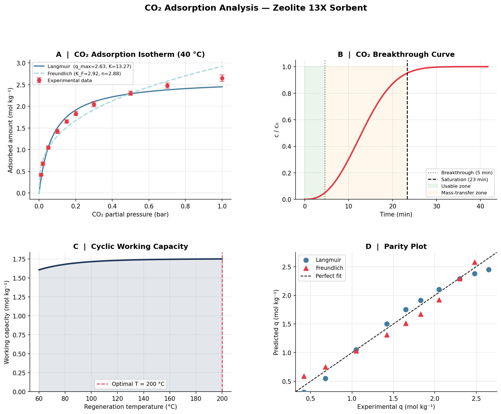

# co2-adsorption-analysis

[](https://github.com/defnalk/co2-adsorption-analysis/actions/workflows/tests.yml)

Python analysis of CO₂ adsorption on solid sorbents, relevant to post-combustion carbon capture. Covers isotherm fitting, breakthrough curve modelling, and cyclic regeneration analysis.

## What it does

| Analysis | Method |
|---|---|
| Adsorption isotherm | Langmuir & Freundlich model fitting via `scipy.optimize.curve_fit` |
| Breakthrough curve | Sigmoidal LDF (linear driving force) model |
| Cyclic working capacity | Temperature-swing adsorption (TSA) with van't Hoff correction |
| Visualisation | 4-panel figure (isotherm, breakthrough, working capacity, parity plot) |

## Background

Solid sorbents (zeolites, MOFs, amine-grafted silica) are promising alternatives to aqueous amine scrubbing for point-source CO₂ capture. This script reproduces the core analyses used to characterise sorbent performance from experimental isotherm data.

Key metrics calculated:
- **q_max** — maximum adsorption capacity (mol kg⁻¹)
- **Breakthrough time** — when exit concentration reaches 5% of inlet
- **Working capacity Δq** — usable loading per TSA cycle

## Installation

```bash
git clone https://github.com/<your-username>/co2-adsorption-analysis.git
cd co2-adsorption-analysis
pip install -r requirements.txt
```

## Usage

```bash
python co2_adsorption_analysis.py
```

Produces a 4-panel figure saved as `co2_adsorption_results.png`:



## Sample Output

```
ISOTHERM FIT PARAMETERS
  Langmuir:   q_max = 2.634 mol/kg,  K_L = 13.27 bar⁻¹
  Freundlich: K_F   = 2.920,         n   = 2.880

BREAKTHROUGH ANALYSIS
  Breakthrough time (5% of c_in):    276 s  (4.6 min)
  Saturation time (95% of c_in):    1398 s  (23.3 min)
  Usable bed fraction:               0.20

REGENERATION ANALYSIS
  Max working capacity:  1.750 mol/kg at T_regen = 200 °C
```

## References

- Ruthven, D.M. (1984). *Principles of Adsorption and Adsorption Processes*. Wiley.
- Casas, N. et al. (2012). Fixed bed adsorption of CO₂/H₂ on activated carbon. *Chem. Eng. J.*
- Wang, J. et al. (2014). CO₂ capture by solid adsorbents. *Energy Environ. Sci.*

## Author

Defne Ertugrul — MEng Chemical Engineering, Imperial College London  
Related to undergraduate UROP work on carbon capture process design.
